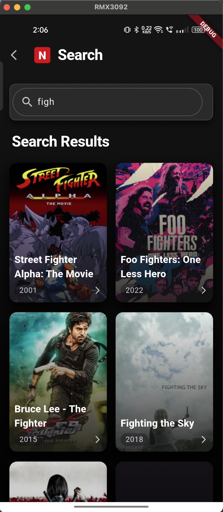
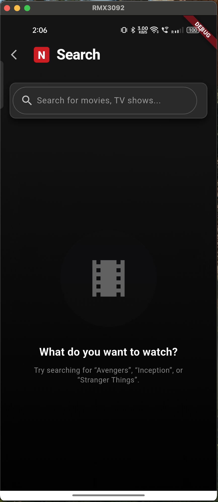
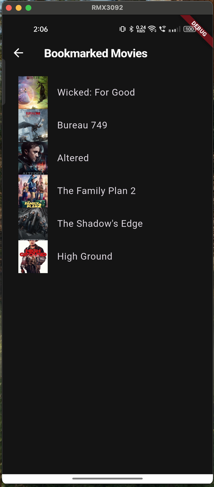
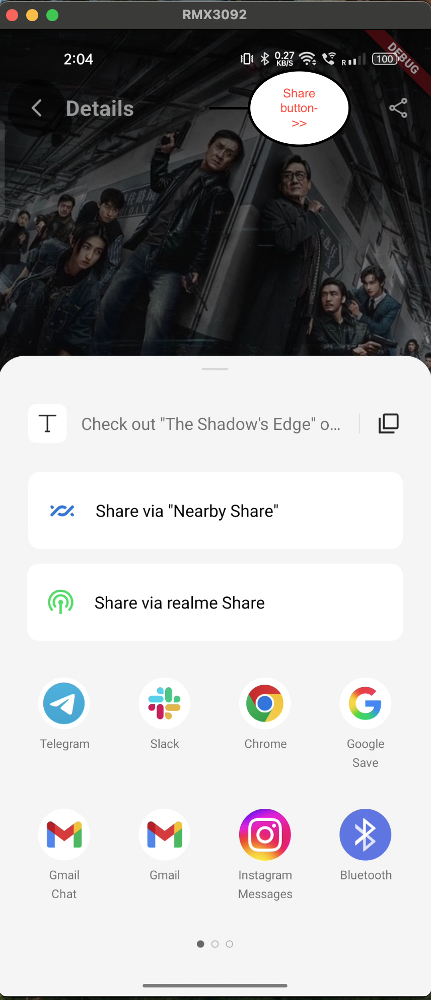
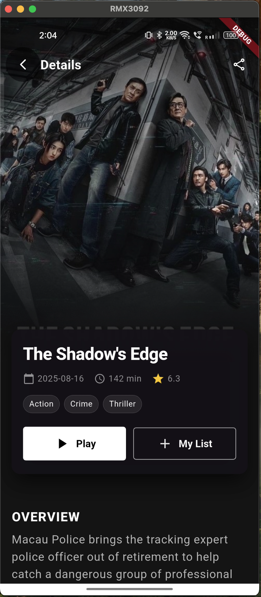

## README : TO UNDERSTAND PROJECT QUICKLY

## Home screen (Discover Movies)

- What: Shows hero banner, “Now Playing” and “Trending Now” horizontal carousels of movies.  
- Where: `HomePage` widget using `HomeBloc` (`home_event_bloc.dart`, states/events).  
- How: On load, dispatches `FetchHomeMovies`, then renders lists from `HomeLoaded` state into Netflix-style cards and hero banner.[1][2]

## Movie details

- What: Detailed info screen for a selected movie (overview, metadata, production info).  
- Where: `MovieDetailsPage` with `MovieDetailsBloc`, navigated from cards and search results.  
- How: Receives `movieId`, dispatches `FetchMovieDetails`, then builds a poster + gradient header and detail sections when `MovieDetailsLoaded` emits.[3][2]

## Search

- What: Netflix-style search page for movies with live query and results grid.  
- Where: `SearchPage` using `SearchBloc` (TextChanged, loading, success, empty, error states).  
- How: TextField changes dispatch `TextChanged`, bloc debounces and calls TMDB via `MovieRepository`, then UI shows a grid of posters or empty/error states.[4][1]

## Rate limit handling

- What: Graceful handling of TMDB API rate-limit or similar network errors.  
- Where: In `SearchBloc` and `MovieDetailsBloc` error branches plus `_showRateLimitDialog` in Search and Details pages.  
- How: When error message contains status 429 / rate limit, emit special state or detect in listener, show a themed dialog, and retry or reset by dispatching a new event on “OK”.[5][1]

## Bookmarks / Watchlist

- What: Lets users bookmark movies and see them later in a saved list.  
- Where: `_NetflixMovieCard` in Home, `SavedMoviesPage`, and `MovieRepository` bookmark methods.  
- How: Bookmark icon toggles `isBookmarked`, calls `addBookmark`/`removeBookmark` on the repository, and saved items are listed from local storage (e.g., DB or in-memory) on the bookmarks page.[2][1]

## BLoC state management

- What: Centralized business logic and async state handling for home, search, and details.  
- Where: `HomeBloc`, `SearchBloc`, `MovieDetailsBloc` plus their event/state files.  
- How: UI dispatches events to blocs, blocs call `MovieRepository` / TMDB API, then emit loading/success/error states that widgets render via `BlocBuilder`/`BlocConsumer`.[3][5]

## Movie repository and TMDB API

- What: Abstraction over TMDB REST API for fetching movies, search results, and details.  
- Where: `MovieRepository` (and underlying `TmdbApiClient` in data layer).  
- How: Exposes methods like `fetchNowPlaying`, `fetchTrending`, `searchMovies`, `fetchMovieDetails`, which blocs call; repository handles HTTP, parsing, and basic error handling.[1][2]

## Netflix-style theming

- What: Global dark Netflix-like look with black background, red accents, and bold typography.  
- Where: `AppTheme.darkTheme` / `AppTheme.lightTheme` in `AppTheme` class, applied in `MaterialApp`.  
- How: Sets `scaffoldBackgroundColor` to `0xFF141414`, `primarySwatch` to red, custom `textTheme`, `appBarTheme`, `cardTheme`, `inputDecorationTheme`, and `dialogTheme` used throughout pages instead of hardcoded colors.[6][7]

## Responsive layout

- What: Adapts spacing and sizes for different screen dimensions.  
- Where: Use of `flutter_screenutil` (`ScreenUtilInit`, `.w`, `.h`, `.sp`) across Home, Search, and Details.  
- How: Wrap root in `ScreenUtilInit`, then scale paddings, font sizes, heights, and widths using ScreenUtil helpers for consistent UI on multiple devices.[8][6]

## Deep link testing (myflix://movie/{id})

- Go to the **Movie Details page for any movie and tap the Share button in the top AppBar; this copies/shares a deep link for that specific movie.  
- The shared link will look like `myflix://movie/{id}`, for example `myflix://movie/550`.[1][2]
- Tapping that link on a device with the app installed will **open the app directly on that movie’s details screen**, instead of just opening the home page.[3][1]

## Screenshots

